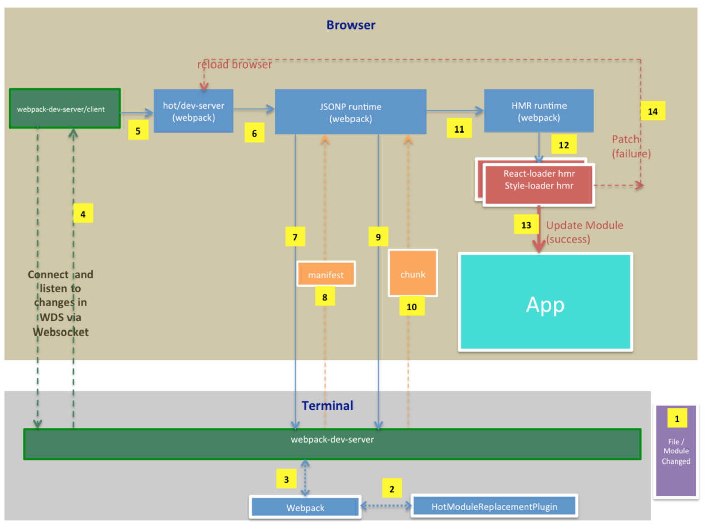

HMR的[介绍](https://medium.com/@rajaraodv/webpack-hot-module-replacement-hmr-e756a726a07)

- HMR 是`webpack`的一个可选功能
- 需要借助`webpack-dev-server`，或者`webpack-hot-middleware`和`webpack-dev-middleware`与`express`搭配使用
- 它只能和实现了`HMR`API的`loaders`一并使用。比如`style-loader`, `react-hot-loader`
- 只能用于开发模式，因为它额外增加了很多代码，并且`webpack-dev-server`只是一个开发模式的服务器

HMR原理图：

> 绿色：`webpack-dev-server`相关的库 
  蓝色：`webpack`核心模块和插件库 
  橙色：chunk清单或者js chunk文件
  红色：`react-hot-loader`或者`style-loader`之类的 HMR库 
  青色：用户App 
  紫色：修改后的js文件夹或者CSS文件 

整个流程：
1. `webpack`使用`HotModuleReplacementPlugin`产生一个清单（一个关于变更模块的JSON文件）和更新的文件
2. `webpack`告知`webpack-dev-server`发生了变更
3. `webpack-dev-server`通过`websocket`发送一个`invalid`通知，告知运行在浏览器的`webpack-dev-server/client`
4. `webpack-dev-server/client`发送初始hash码给`hot/dev-server`库（`webpack-dev-server/client`在app第一次被加载时会得到一个hash码）
5. `hot/dev-server`调用内部模块（JSONP运行时，被`webpack`注入的模块）去下载清单文件
6. `JSONP运行时`使用hash码从`webpack-dev-server`处加载清单文件
7. 清单文件包含了浏览器需要加载的文件（chunk）的细节，名字类似这样的结构：`b2e2d54372f42c1b2352.hot-update.json`
8. `JSONP运行时`然后使用这个清单去下载更新文件（chunk）
9. 更新文件其实是个JS文件，里面包含了需要更新的细节信息，需要被应用到DOM中
10. 使用模块id去调用`HMR运行时`，同时附加上更新内容
11. `HMR运行时`不知道这些具体的东西要如何被应用到DOM中，所以它将这些转发给响应的`l;oader`，比如：`react-hot-loader`运行时或者`css-loader`运行时来应用这些变更（这些HMR运行时是被浏览器注入的）。
12. 如果在应用的过程中没有错误，那么就会更新APP
13. 如果在应用过程中发生了错误，那么`hot\dev-ser`库会得到通知

