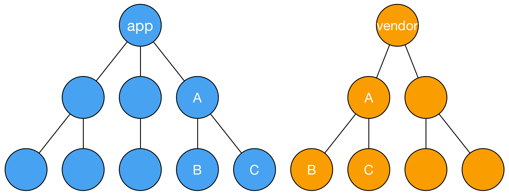
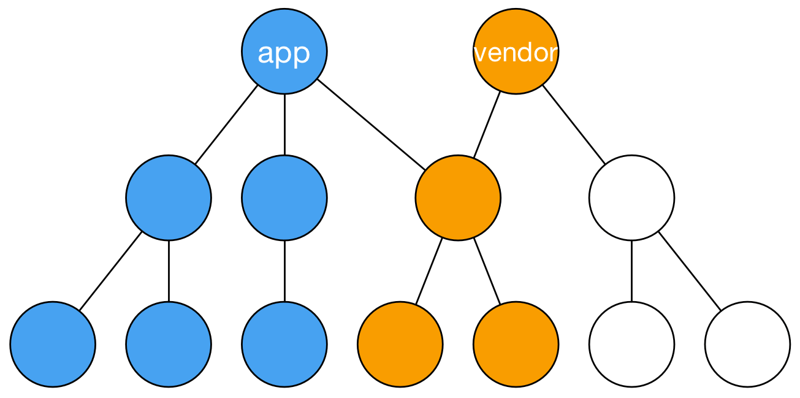
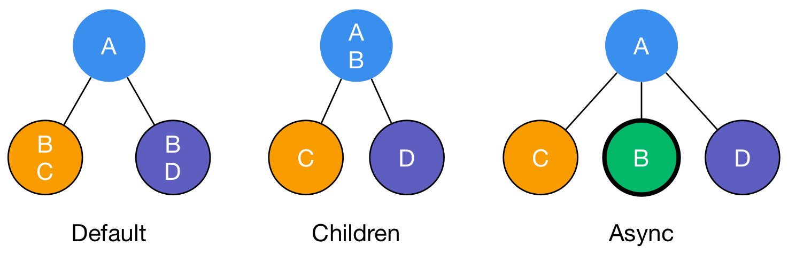

# Webpack-survive-tutorial

Content from [survivijs](https://survivejs.com/webpack/introduction/)


## `Webpack`是什么？
`Webpack`是个模块打包器（module bundler）。

## `Webpack`是如何做到的？
在底层，`Webpack`通过遍历源代码，使用源代码中的模块关系，构造出了一个`有向依赖图`（`dependency graph`）。然后使用这个依赖图和其他配置信息产生bundle文件。

配置信息包括：
- loaders
  作用在模块层
- plugins
  依赖于`Webpack`提供的钩子（hook）
- 配置
  描述如何将依赖图的assets进行转换，以及如何产生输出
- HMR


## Developing
安装：
```js
yarn add webpack -D
```

简单的运行`Webpack`，比如：
```js
node_modules/.bin/webpack app/index.js build/index.js
```

或者在`package.json`中添加脚本：
```js
script: {
  "build": "webpack app/index.js build/index.js"
}
```
因为`npm run`会自动添加`node_modules/.bin/`路径到环境变量中，所以可以直接使用`webpack`命令行工具。

同时可以使用`webpack.config.js`来配置`webpack`的运行参数。主要有四点：
- entry
- ouput
- rules
- plugin

`webpack`可以使用`--config`来指定配置文件的路径。如果不指定，则默认与`package.json`同层。

---
在开发工程中，自动化是个非常重要的特性。`Webpack`可以通过`Watch`模式或者`webpack-dev-server`来实现。
```js
webpack --watch
```
可以监控文件的状态，如果文件发生了变更，那么`Webpack`会自动重新打包。

`webpack-dev-server`实现了`Watch`的功能，同时还实现了一些更酷的特性。`webpack-dev-server`是一个开发服务器，运行的所有文件都存在内存中。它配合`webpack`的`HMR`可以实现浏览器的自动刷新。如果是使用`React`，那么配合`react-hot-loader`可以实现组件的热替换，同时组态的状态保持不变。
具体的可以参考`webpack-dev-server`目录中的例子。


`webpack-dev-server`在我们每次修改源文件时，可以自动打包然后更新到内存的服务器中。但是对于配置文件`webpack.config.js`的修改，每次都要在命令行中重启`webpack-dev-server`。可以通过`nodemon`来解决。
首先安装：
```js
yarn add nodemon -D
```
在`package.json`中的脚本中加入：
```js
"scripts": {
  "start": "nodemon --watch webpack.config.js --exec \"webpack-dev-server\"",
  "build": "webpack"
},
```

`webpack-dev-server`的其他`options`可以参考[DevServer](https://webpack.js.org/configuration/dev-server/)

---
组合式的配置。可以用以下方式来管理`Webpack`的配置信息：
- 将配置文件根据运行环境分布到多个文件中，然使用`--config`来指定
- 将配置文件打包到库中。比如：`webpack-blocks`, `electron-webpack`
- 将配置文件打包到工具中。比如`create-react-app`
- 将配置信息放入到单个文件来管理。然通过`--env`参数来控制运行的环境

我们通过将工程`webpack-react`的配置重构成组合式的`Webpack`配置来演示整个过程。


## Styling

查找原理：
`css-loader`默认资源查找的是相对路径。如果需要引入绝对路径下的资源，需要依赖插件`copy-webpack-plugin`。对于`Sass`和`Less`，有`resolve-url-plugin`。

`css-loader`针对于`@import`和`url()`引入的样式风格。
`style-loader`则是将其转换成JavaScript插入到DOM中，并且同时实现了`Webpack`的`Hot Module Replacement`接口。

文件的提取和自动增加前缀以及其他的配置参考`webpack-react`工程。

压缩可以使用`purifycss-webpack`插件。需要注意的是，CSS文件的提取是在压缩前；同时，CSS会失去`source maps`。


## Loading Assets
`Webpack`的加载器（loaders）的加载顺序是`从右到左`，`从下到上`。比如：
```js
{
  test: /\.css$/,
  use: ["style-loader", "css-loader"],
},
```
和
```js
{
  test: /\.css$/,
  use: "style-loader",
},
{
  test: /\.css$/,
  use: "css-loader",
},
```
是等价的。但是也可以使用`enforce`来强制设置加载时机。选项包括：`pre`和`post`。

内联定义：
```js
// Process foo.png through url-loader and other
// possible matches.
import "url-loader!./foo.png";

// Override possible higher level match completely
import "!!url-loader!./bar.png";
```

其他的配置，比如加载图片、字体，参考`webpack-react`工程。


## Building
`Source Maps`参考[官方文档](https://webpack.js.org/configuration/devtool/#devtool)

---
`bundle split`




`CommonsChunkPlugin`有三个标志：
- default
- children
- async



---
`code split`
有两种方式实现：
- import（dynamic import尚未被官方支持，使用时需要Babel支持（babel-plugin-syntax-dynamic-import））
  ```js
  Promise.all([
    import("lunr"),
    import("../search_index.json"),
    ]).then(([lunr, search]) => {
      return {
        index: lunr.Index.load(search.index),
        lines: search.lines,
      };
  });
  ```
- require.ensure
  ```js
  require.ensure(
    // Modules to load, but not execute yet
    ["./load-earlier"],
    () => {
      const loadEarlier = require("./load-earlier");

      // Load later on demand and include to the same chunk
      const module1 = require("./module1");
      const module2 = require("./module2");

      ...
    },
    err => console.error(err),
    "optional-name"
  );
  ```
  上面的例子也可以这样写：
  ```js
  require.ensure(
    [],
    () => {
      require.include("./load-earlier");

      const loadEarlier = require("./load-earlier");

      // Load later on demand and include to the same chunk
      const module1 = require("./module1");
      const module2 = require("./module2");

      ...
    }
  );
  ```

首先需要找到一个分离点使得负载按需加载。


## Optimizing

### Minifying
- minifying Javascript
- minifying html
- minifying CSS
- minifying images

### Tree Shaking 
以静态的方式分析模块的定义。`Webpack`可以通过这个特性得知哪部分的代码被利用了，哪部分的代码没被利用。

### env
`webpack.DefinePlugin`

### hash
- [hash]
- [chunkhash]
- [contenthash] 

### manifest
包含了启动app的信息。有些插件可以使得独立的`manifest`自动插入html页面

### 构建分析
可以在`package.json`的脚本中：
```js
"build:stats": "webpack --env production --json > stats.json",
```

也可以使用一些插件，例如：`webpack-bundle-analyzer`, `webpack-bundle-analyzer`, `Webpack Visualizer`等。

### performance 
构建的性能。

- parallel-webpack
- HappyPack

- 低级别的优化
  1. 使用更快的 `source map`
  2. 开发阶段使用`babel-prset-env`
  3. 开发阶段不要使用polyfills
  4. 屏蔽开发阶段不需要的部分
  5. 将不怎么改变的bundle放入到DLL（Dynamically Loaded Library）中
- Plugin 特定优化
- Loader 特定优化
- 再打包（rebundling）优化

## Output
### targert
- web（默认）
- webworker 
    1. 不能使用hash特性
    2. 不能从 web worker 中操纵DOM
- node/async-node
- node-webkit（NW.js）
- atom, electron, electron-main（主进程）
- electron-renderer（渲染进程）

### 多入口
### SSR

## Techniques
### 动态加载
### web worker
### 国际化
- i18n

### 测试
- Mocha
- Karma
- Jest

### 部署
- gh-pages

### 包别名
内部别名:
```js
{
  resolve: {
    alias: {
      demo: path.resolve(
        __dirname,
        "node_modules/demo/dist/demo.js"
      ),
    },
  },
},
```

外部：
```js
externals: {
  jquery: "jquery",
},
```

## Extending
### loader扩展
### plugin扩展

## 通用 Checklist
- source map
- 如果需要构建快速，可以参考优化章节
- 对于配置文件的可管理性，可以使用组合式配置
- 可以编写自定义的`Loader`和`Plugin`

## 开发 Checklist
- webpack-dev-server
- HMR

## 产品 Checklist
- Styling
  1. 是否独立成文件
  2. 是否增加前缀（autoprefixing）
  3. 是否进行未使用的CSS检测
- Assets
  1. images
  2. fonts
  3. minifying
- Caching
  1. bundle分离
  2. 代码分离
  3. 文件名增加 hash
- Optimization
  1. tree shaking
  2. 环境变量
  3. 构建分析（build analysis）
  4. web worker
- Output
  1. rm 或者 rimraf 
  2. clean-webpack-plugin
